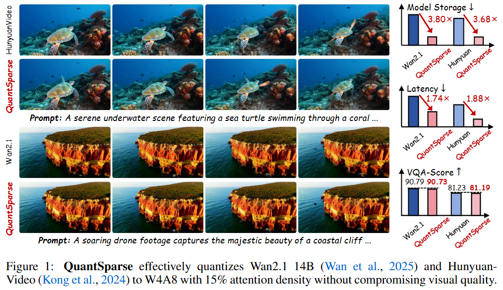
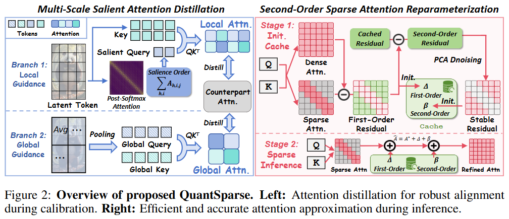
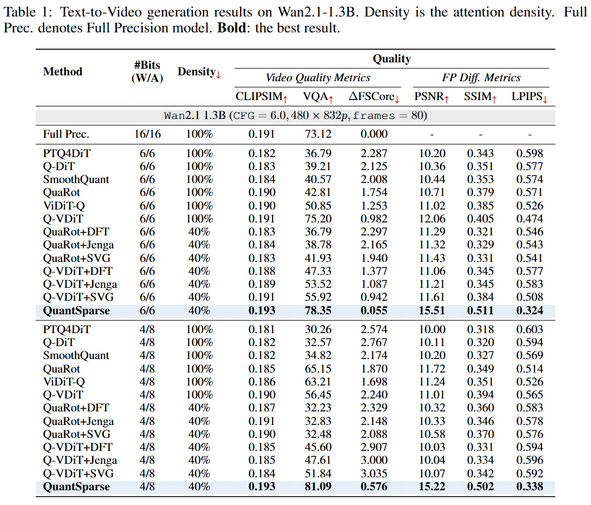

# QuantSparse: Comprehensively Compressing Video Diffusion Transformer with Model Quantization and Attention Sparsification

[arXiv](https://arxiv.org/abs/2509.21302) | [BibTeX](#bibtex)

------

This project is the official implementation of our "QuantSparse: Comprehensively Compressing Video Diffusion Transformer with Model Quantization and Attention Sparsification".





------

## Results



## Comments

- Our code will be released soon!

## BibTeX

If you find *QuantSparse* is useful and helpful to your work, please kindly cite this paper:

```
@misc{feng2025quantizedvisualgeometrygrounded,
      title={Quantized Visual Geometry Grounded Transformer}, 
      author={Weilun Feng and Haotong Qin and Mingqiang Wu and Chuanguang Yang and Yuqi Li and Xiangqi Li and Zhulin An and Libo Huang and Yulun Zhang and Michele Magno and Yongjun Xu},
      year={2025},
      eprint={2509.21302},
      archivePrefix={arXiv},
      primaryClass={cs.CV},
      url={https://arxiv.org/abs/2509.21302}, 
}
```

